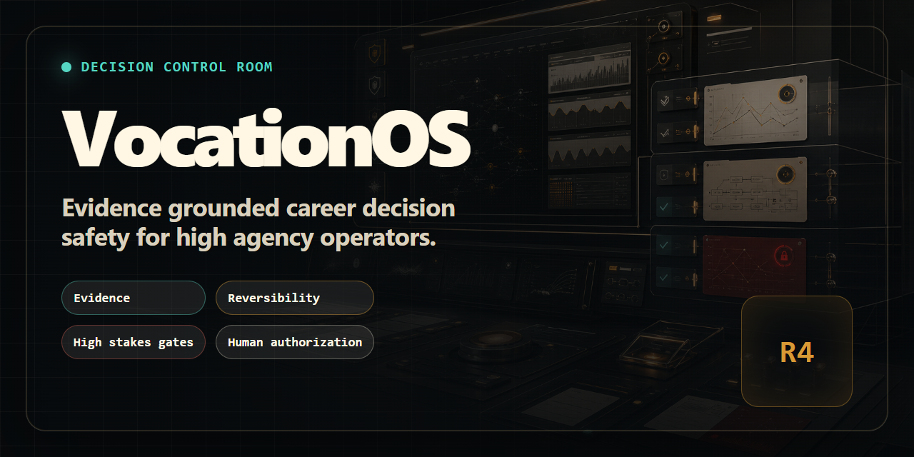

# VocationOS

Evidence grounded career decision safety for high agency operators.




VocationOS is a local first career decision safety system. It makes consequential automation conditional on evidence, reversibility, stakes, scoped human authorization, and verifiable completion evidence.

Website: https://onourimpram.github.io/vocation-os/

## Current Release

Version 0.4.0 is the canonical local runtime and authority release.

It includes the deterministic safety kernel, claim and packet integrity, persistent kill switch state, scoped approvals, trusted submission collectors, a migrated encrypted SQLite event store, checksummed schema migrations, encrypted backup and restore, a temporal Career Digital Twin contract, opportunity provenance, theory grounded advisory tools, claim first document structures, portfolio analysis, outcome contracts, and VocationBench.

`vocationd` is the shipped single writer for consequential local runtime mutations. CLI commands that change auto apply state, import legacy state, create audit checkpoints, manage approvers, or export authority state go through authenticated IPC with request idempotency. Desktop workbench, browser extension, twelve discovery adapters, full interview and offer labs, production collector key custody, and production execution adapters remain roadmap work.

Version 0.4.0 ships no production auto apply adapter. Its compiled execution boundary permits only `local-fixture` with a synthetic profile. Adding an adapter string to config cannot grant production execution authority.

## Why It Exists

A draft, a public claim, an outreach message, a submitted application, a licensing decision, and an international relocation do not have the same reversibility.

Most career tooling optimizes output volume. VocationOS optimizes decision quality and prevents unsupported claims, stale evidence, replayed approvals, unsafe automation, and false completion records.

## Implemented Controls

| Control | Runtime behavior |
| --- | --- |
| Claim integrity | Canonical claim hashes and packet hashes are recomputed before automation. |
| Document integrity | Every packet document must exist inside an explicit root and match its content hash. |
| Recency | Time sensitive claims use explicit policy windows and stale evidence blocks action. |
| Reversibility | Every Approved Auto action requires scoped approval. R3 cannot be downgraded. R4 never auto submits. |
| High stakes | Every high stakes flag requires an explicit boolean assessment. Any positive flag blocks auto mode. |
| Risk observations | CAPTCHA, anti bot, payment, identity, ToS, license, and fabrication signals must all be observed. |
| Authorization | Ed25519 approval binds a trusted approver, opportunity, packet, adapter, action intent, allowed field, and expiry. |
| Rate limit | Submission usage is calculated only from the daemon owned encrypted ledger. Caller counters and draft events are ignored. |
| Kill switch | Kill, rearm, and enable are separate idempotent daemon operations persisted in the encrypted event store. |
| Completion proof | Only a trusted Ed25519 collector receipt bound to attempt, action intent, packet, and adapter can confirm submission. |
| Local privacy | Sensitive event payloads and the chain head are encrypted with AES 256 GCM and authenticated before read. |
| Runtime authority | HMAC authenticated IPC, monotonic request sequences, durable command receipts, and a single instance lock protect the local writer boundary. |
| Rollback detection | Ed25519 checkpoints bind the database, migration version, event count, chain head, and prior checkpoint digest. The latest digest is retained outside SQLite. |
| Agent separation | Registered worker manifests enforce phase capabilities. Execute scopes are distinct. A generator cannot self-evaluate and only a human can approve. |

## Quick Start

```bash
npm ci
npm run typecheck
npm run test
npm run validate:schemas
npx tsx src/cli.ts doctor
npx tsx src/cli.ts benchmark
```

Build and start the canonical local authority in a separate terminal:

```bash
npm run build
vocationd start
```

The default daemon uses the native OS credential store. A non graphical host can use an encrypted passphrase backed credential vault without environment variables or command line secrets:

```bash
vocationd start --headless
```

Then inspect authority health and plan a non destructive legacy import:

```bash
vocation daemon-status
vocation legacy-import-plan
```

Apply only the exact plan hash that was reviewed:

```bash
vocation legacy-import-apply sha256:<approved-plan-hash>
```

Run the complete release candidate gate:

```bash
npm run safe:publish-check
```

## Decision Architecture

```text
Career Digital Twin
  -> Opportunity provenance and labor market graph
  -> Deterministic intake and hard gates
  -> Theory grounded planning
  -> Claim first document AST
  -> Independent evaluation
  -> Scoped human ApprovalReference
  -> Allowlisted application operator
  -> Trusted collector SubmissionProof
  -> Encrypted event and outcome history
  -> Calibrated learning
```

The agent controller follows:

```text
Observe -> Normalize -> Gate -> Plan -> Generate
        -> Evaluate -> Approve -> Execute -> Verify -> Learn
```

No LLM, plugin, adapter, or worker owns the final side effect boundary. The deterministic controller and human approval gate do.

## Career Intelligence Foundation

### Career Digital Twin

Temporal facts carry validity windows, evidence status, source pointers, confidence, sensitivity, and allowed uses. Sensitive facts cannot be exposed through public profile use.

### Opportunity Graph

Greenhouse, Lever, and Ashby payloads have pure normalization adapters. Opportunity records retain canonical URLs, source payload hashes, description hashes, fingerprints, freshness, remote eligibility, and extraction confidence.

O*NET, ESCO, and local occupation concepts can be attached with taxonomy version provenance. Current matching is a deterministic foundation, not a learned labor market model.

### Portfolio Analysis

Jobs, fellowships, postdocs, grants, consulting, teaching, speaking, publishing, and venture routes share a multi objective evaluation surface. Hard gated options are excluded before utility scoring. Pareto efficiency and weighted regret remain visible.

### Claim First Documents

Every body sentence in the Document AST uses `verbatim-claim` binding to exactly one claim ID. Its normalized text must match the verified claim text. Missing, inflated, unverified, private, or disallowed claims prevent rendering. Hidden Unicode text is rejected. Human-approved synthesis over multiple claims remains a later, separately gated contract.

## CLI

```bash
npx tsx src/cli.ts demo-career-twin
npx tsx src/cli.ts demo-opportunity-intake
npx tsx src/cli.ts demo-portfolio
npx tsx src/cli.ts demo-skill-coach
npx tsx src/cli.ts demo-advisory
npx tsx src/cli.ts demo-auto-apply-decision
npx tsx src/cli.ts benchmark
npx tsx src/cli.ts list-workers
```

With `vocationd` stopped, verify the canonical encrypted store or create an interactive encrypted backup:

```bash
vocation store-verify
vocation store-backup ./backups/vocation.vocationbak
```

`store-doctor` remains a compatibility alias for `store-verify` through the next minor release. No passphrase is accepted through process arguments or environment variables.

## VocationBench

VocationBench materializes deterministic synthetic stubs for 500 profiles, 1,000 opportunities, 200 adversarial cases, and 100 completion proof cases. Full synthetic Career Digital Twins and executable baseline adapters remain part of the benchmark expansion.

The harness implements NDCG, Brier score, expected calibration error, F1, false allow rate, and false confirmation rate. Current code establishes the benchmark protocol and metric engine. A public competitor leaderboard requires reproducible baseline runs and is not yet claimed.

See [docs/VOCATIONBENCH.md](docs/VOCATIONBENCH.md).

## Metrics

The values below are checked by `npm run docs:check`.

| Metric | Count |
| --- | ---: |
| Modes | 21 |
| Theories | 28 |
| Rubric dimensions | 20 |
| Schemas | 20 |
| CLI commands | 42 |
| Evaluator tests | 19 |

## What This Is Not

VocationOS is not an autonomous hiring system.

It is not a legal, immigration, clinical, financial, tax, or licensing authority.

It does not rank, reject, or filter candidates for employers.

It does not bypass CAPTCHA, anti bot controls, identity checks, platform terms, or application rules.

It does not treat an application as complete from caller supplied text or tracker status.

It is not yet a finished v1 desktop product. Version 0.4.0 is a tested local runtime foundation for that product.

## Governance

VocationOS is scoped to individual career decision support. Employer side ranking, filtering, rejection, and hiring decisions remain out of scope.

See [SAFETY.md](SAFETY.md), [GOVERNANCE.md](GOVERNANCE.md), [PRIVACY.md](PRIVACY.md), [docs/ARCHITECTURE.md](docs/ARCHITECTURE.md), [docs/THREAT_MODEL.md](docs/THREAT_MODEL.md), and [docs/V0.4_MIGRATION.md](docs/V0.4_MIGRATION.md).

## Contributing

Every new mode requires a schema, unit tests, adversarial tests, evaluator coverage, documentation, and a high stakes assessment.

Public fixtures must remain synthetic. Safety policy changes require dedicated review and cannot be hidden inside feature work.
