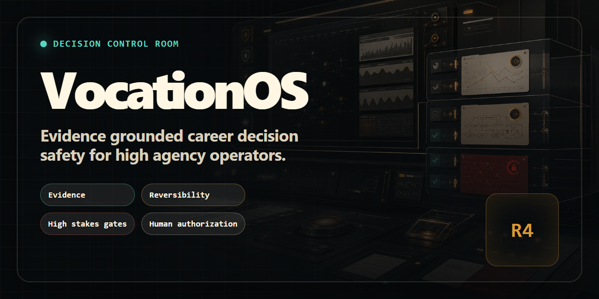

# VocationOS

A local-first daemon for career decisions — apply, outreach, relocation, licensing — that will not execute a consequential action until the evidence and a scoped human approval check out, and will not record it as done without a trusted collector receipt.



[](https://github.com/OnourImpram/vocation-os/actions/workflows/ci.yml)
[](https://github.com/OnourImpram/vocation-os/actions/workflows/security.yml)
[](tsconfig.json)
[](test/red-team)


You are about to let software do something that cannot be undone: send the outreach, submit the form, publish the claim. Afterwards there is usually no way to prove it acted only on evidence someone actually verified, that a human authorised that exact action rather than a similar one, or that the `submitted` it reported ever happened. If the controls are prompts and config flags, anything that can edit config can turn the safety off.

VocationOS refuses to execute a consequential action unless every claim behind it traces to verified evidence and a human has signed an approval scoped to that exact action, and it refuses to mark that action complete without a trusted Ed25519 collector receipt. The refusal is logged either way.

Two readers get something from it today: the operator running their own career decisions on their own machine, and the engineer reading it as a worked example of these controls enforced in compiled code and adversarial tests rather than in prompts. No production execution adapter ships in 0.6.2; what is implemented is the enforcement path, not application volume.

Website: [onourimpram.github.io/vocation-os](https://onourimpram.github.io/vocation-os/)

A refusal, from the shipped demo command:

```console
$ node dist/cli.js demo-auto-apply-decision
{
  "allowed": false,
  "blockedBy": "packet-evidence-not-verified",
  "reasons": [
    "packet-evidence-not-verified:CLM-DEMO-001",
    "document-hash-mismatch:cv"
  ],
  "requiredApprovals": [],
  "confirmationEvidenceRequired": true,
  "ledgerActionId": "A-2026-573a3533-3db7-4594-b6a8-ef5d923d73ee"
}
```

The `ledgerActionId` is new on each run. Other refusals on the same decision path carry `execution-adapter-not-shipped`, `local-fixture-requires-synthetic-profile`, and `high-stakes-requires-manual-review` (`src/auto-apply.ts:171-188`).

Requires Node 22.13 or later; `.nvmrc` pins 22.23.1.

```bash
git clone https://github.com/OnourImpram/vocation-os.git && cd vocation-os && npm ci && npm run build && node dist/cli.js doctor
```

Version 0.6.2 is a source-first GitHub release. Registry installation remains intentionally unavailable until the typed SDK and root package complete a separate npm release pass.

Then run the complete synthetic onboarding journey. The CLI starts the local daemon when needed:

```bash
node dist/cli.js init --demo
```

- **Config data cannot grant execution authority.** Pushing `greenhouse` into the operator's `adapterAllowlist` still returns `blockedBy: "execution-adapter-not-shipped"`, because the compiled shipped-adapter check runs before the allowlist is read — and that compiled list holds exactly one adapter, a local synthetic fixture.
  Evidence: `src/auto-apply.ts:69,171-173,177-179`, `test/red-team/release-blockers.test.ts:149-165`

- **The safety benchmark is a gate, not a report.** Corrupt one fixture label and the suite goes to `FAIL` with a changed deterministic run ID, and the CLI exits non-zero on any run that does not pass.
  Evidence: `test/unit/vocation-bench.test.ts:138-153`, `src/cli.ts:493-497`, thresholds frozen at `src/benchmark/vocation-bench.ts:125-137`

- **Failed verification is kept as failure, not rounded up.** The committed portal-catalog run attempted 487 routes, confirmed 278, and left 209 unresolved, with a nine-way failure-reason breakdown and separate SHA-256 digests for the verified catalog and the unresolved set.
  Evidence: `catalog/v1/verification-report.json:14-16,30-42`

## Scope and limits

What 0.6.2 does not do.

Version 0.6.2 is the source-first decision intelligence release with descriptor-bound artifact export recovery.

Version 0.6.2 still ships no production auto apply adapter. Its compiled execution boundary permits only `local-fixture` with a synthetic profile. Adding an adapter string, agent integration, MCP client, or model provider cannot grant production execution authority. The MCP server it ships is read-first.

`vocationd` remains the single writer for consequential local mutations. Remote discovery is off by default and requires a signed, scoped `NetworkAccessGrant`. The portal catalog keeps 209 unresolved routes outside the verified set instead of upgrading failed checks into evidence.

A draft, a public claim, an outreach message, a submitted application, a licensing decision, and an international relocation do not have the same reversibility, and the gates are graded accordingly. VocationOS optimizes decision quality and prevents unsupported claims, stale evidence, replayed approvals, unsafe automation, and false completion records.

The benchmark is narrow and reported as such. The committed 94-case fixture set is executed by the test suite under `npm run ci` on both Ubuntu and Windows (`docs/VOCATIONBENCH.md:7`, `test/unit/vocation-bench.test.ts:22-26,68-69`, `.github/workflows/ci.yml:16-19,28`). Two of the eleven frozen thresholds — minimum ranking improvement and minimum safety mutation score — remain `not-evaluated`, and all three named baselines remain `not-run` (`test/unit/vocation-bench.test.ts:106-116`).

Further limits are stated in the sections below: the install path in Quick Start, headless daemon rules, liveness and taxonomy qualifications, answer reuse restrictions, credential verification boundaries, benchmark scope, and the explicit What This Is Not list.

## Implemented Controls

| Control | Runtime behavior |
| --- | --- |
| Claim integrity | Canonical claim hashes and packet hashes are recomputed before automation. |
| Document integrity | Every packet document must exist inside an explicit root and match its content hash. |
| Recency | Time sensitive claims use explicit policy windows and stale evidence blocks action. |
| Reversibility | Every Approved Auto action requires scoped approval. R3 cannot be downgraded. R4 never auto submits. |
| High stakes | Every high stakes flag requires an explicit boolean assessment. Any positive flag blocks auto mode. |
| Risk observations | CAPTCHA, anti bot, payment, identity, ToS, license, and fabrication signals must all be observed. |
| Authorization | Ed25519 approval binds a trusted approver, opportunity, packet, adapter, action intent, allowed field, and expiry. |
| Rate limit | Submission usage is calculated only from the daemon owned encrypted ledger. Caller counters and draft events are ignored. |
| Kill switch | Kill, rearm, and enable are separate idempotent daemon operations persisted in the encrypted event store. |
| Completion proof | Only a trusted Ed25519 collector receipt bound to attempt, action intent, packet, and adapter can confirm submission. |
| Local privacy | Sensitive event payloads and the chain head are encrypted with AES 256 GCM and authenticated before read. |
| Artifact privacy | CV, PDF, DOCX, and generated artifacts use an independent AES 256 GCM vault key and keyed storage locators. Raw source paths are not persisted. |
| Import integrity | Profile parsing runs in a bounded child process. Apply requires the exact persisted plan hash and imported facts remain analysis only until claim review. |
| Render integrity | PDF and DOCX are written only after every content node traces to one verified claim and both formats pass parse back verification. |
| Runtime authority | HMAC authenticated IPC, monotonic request sequences, durable command receipts, and a single instance lock protect the local writer boundary. |
| Rollback detection | Ed25519 checkpoints bind the database, migration version, event count, chain head, and prior checkpoint digest. The latest digest is retained outside SQLite. |
| Agent separation | Registered worker manifests enforce phase capabilities. Execute scopes are distinct. A generator cannot self-evaluate and only a human can approve. |

## Quick Start

Version 0.6.2 is a source-first GitHub release. Registry installation remains intentionally unavailable until the typed SDK and root package complete a separate npm release pass.

```bash
npm ci
npm run typecheck
npm run test
npm run validate:schemas
npm run build
node dist/cli.js doctor
```

Run the complete synthetic onboarding journey with one command. The CLI starts the local daemon when needed:

```bash
vocation init --demo
```

Import a real local PDF, DOCX, Markdown, or UTF-8 profile source. This stores the encrypted artifact, creates a hash bound plan, and stops at claim review:

```bash
vocation init --profile /absolute/path/to/profile.pdf
vocation profile-import-apply sha256:<reviewed-plan-hash>
```

The same flow can be declared in a schema validated config file with `version`, `mode`, and `profilePath`:

```bash
vocation init --config ./vocation-init.json
```

The default daemon uses the native OS credential store. A non graphical host can use an encrypted passphrase backed credential vault without environment variables or command line secrets:

```bash
vocationd start --headless
vocation daemon-status --headless
vocation onboarding-status --headless
vocation daemon-stop --headless
```

Every CLI command that connects to a headless daemon must include `--headless`. VocationOS detects a headless credential vault and returns an actionable provider mismatch error instead of silently selecting the OS keyring.

Inspect authority health, product records, tracker state, or plan a non destructive legacy import:

```bash
vocation daemon-status
vocation daemon-stop
vocation onboarding-status
vocation domain-list opportunities
vocation tracker-list
vocation legacy-import-plan
vocation legacy-import-apply sha256:<approved-plan-hash>
```

Run the complete release gate:

```bash
npm run safe:publish-check
```

## Decision Architecture

```text
Career Digital Twin
  -> Opportunity provenance and labor market graph
  -> Deterministic intake and hard gates
  -> Theory grounded planning
  -> Claim first document AST
  -> Independent evaluation
  -> Scoped human ApprovalReference
  -> Allowlisted application operator
  -> Trusted collector SubmissionProof
  -> Encrypted event and outcome history
  -> Calibrated learning
```

The agent controller follows:

```text
Observe -> Normalize -> Gate -> Plan -> Generate
        -> Evaluate -> Approve -> Execute -> Verify -> Learn
```

No LLM, plugin, adapter, or worker owns the final side effect boundary. The deterministic controller and human approval gate do.

## Career Intelligence Foundation

### Career Digital Twin

Temporal facts carry validity windows, evidence status, source pointers, confidence, sensitivity, and allowed uses. Sensitive facts cannot be exposed through public profile use.

### Opportunity Truth and Taxonomy

Thirty six provider adapters share a versioned parser contract covering malformed payloads, pagination, schema drift, and provider-specific identity. Every governed retrieval produces an immutable source observation. Opportunity records retain canonical URLs, source payload hashes, description hashes, fingerprints, freshness, remote eligibility, and extraction confidence.

Liveness requires provider identity, active state, and a usable application endpoint. Timeouts and provider failures remain `unresolved`. Dedupe uses source identity, canonical apply routes, organization domain, normalized role and location, content provenance, and taxonomy adjacency. Ambiguous relations enter the review queue and cannot be silently merged.

O*NET, ESCO, and local occupation concepts use versioned snapshots and deterministic mappings with source codes or URIs, matched terms, and confidence. Model suggestions are advisory and cannot become authoritative taxonomy mappings.

### Portfolio Analysis

Jobs, fellowships, postdocs, grants, consulting, teaching, speaking, publishing, and venture routes share a multi objective evaluation surface. Hard gated options are excluded before utility scoring. Pareto efficiency and weighted regret remain visible.

### Claim First Documents

Every content node in Document AST v2 uses `verbatim-claim` binding to exactly one claim ID and the canonical claim text hash. Its normalized text must match the verified claim text. Missing, inflated, unverified, private, or disallowed claims prevent rendering. Hidden Unicode text is rejected. PDF and DOCX output uses packaged Noto Sans fonts and must pass parse back verification before it is written. Human-approved synthesis over multiple claims remains a later, separately gated contract.

### Product Operations

Profiles, opportunities, documents, campaigns, applications, tasks, outcomes, and application answers are versioned encrypted aggregates. Optimistic concurrency and request replay checks protect mutations. Application records use lifecycle specific tracker operations, so generic domain writes cannot manufacture an approved or confirmed status.

Answer memory is scope, sensitivity, expiry, evidence, and use mode aware. Work authorization, visa, relocation, compensation, and licensing answers require per opportunity confirmation and cannot be used in Approved Auto. EEO responses are never resolved for reuse.

The Ink TUI presents separate application and discovery queues through the typed SDK. Discovery actions create audited review tasks only. The React workbench uses a bearer, CSRF, capability-bound loopback gateway on `127.0.0.1`; it does not read SQLite directly. The Tauri shell packages the same workbench and has a dedicated Windows Rust validation workflow.

Career Assurance Case exports bind recommendations to evidence, uncertainty, defeaters, policy decisions, approvals, receipts, and version manifests. Credential Passport imports preserve original artifacts and separate schema, signature, issuer, subject, time, revocation, and refresh results. Compact JWS and `eddsa-rdfc-2022` Data Integrity proofs receive real cryptographic verification. Pinned VC, Open Badges, Data Integrity, and Multikey contexts plus `did:key` resolution remain offline. HTTPS issuer material is accepted only through an explicitly supplied bounded document loader. A valid credential signature is never treated as proof that every real-world career claim is true.

## CLI

```bash
npx tsx src/cli.ts demo-career-twin
npx tsx src/cli.ts demo-opportunity-intake
npx tsx src/cli.ts demo-portfolio
npx tsx src/cli.ts demo-skill-coach
npx tsx src/cli.ts demo-advisory
npx tsx src/cli.ts demo-auto-apply-decision
npx tsx src/cli.ts benchmark
npx tsx src/cli.ts list-workers
```

Product commands are available from the compiled CLI:

```bash
vocation init --demo
vocation init --profile ./profile.docx
vocation profile-import-plan-show
vocation artifact-list
vocation domain-list profiles
vocation tracker-list
vocation document-render ./document-v2.json ./claim-graph.json ./exports
vocation discover help
vocation taxonomy help
vocation assurance help
vocation credential help
vocation tui --queue all
vocation workbench --no-open
vocation agents status
vocation models status
vocation benchmark
```

With `vocationd` stopped, verify the canonical encrypted store or create an interactive encrypted backup:

```bash
vocation store-verify
vocation store-backup ./backups/vocation.vocationbak
```

`store-doctor` remains a compatibility alias for `store-verify` through the next minor release. No passphrase is accepted through process arguments or environment variables.

## VocationBench

VocationBench materializes deterministic synthetic stubs for 500 profiles, 2,000 opportunities, 300 adversarial cases, 200 completion proof cases, and 100 credential cases. Its committed executable fixture set contains 94 bounded liveness, dedupe, safety, proof, claim trace, and calibration cases.

The harness implements NDCG, Brier score, expected calibration error, F1, false allow rate, and false confirmation rate. Current code establishes the benchmark protocol and metric engine. A public competitor leaderboard requires reproducible baseline runs and is not yet claimed.

See [docs/VOCATIONBENCH.md](docs/VOCATIONBENCH.md).

## Metrics

The values below are checked by `npm run docs:check`.

| Metric | Count |
| --- | ---: |
| Modes | 21 |
| Theories | 28 |
| Rubric dimensions | 20 |
| Schemas | 53 |
| CLI commands | 73 |
| Evaluator tests | 19 |

## What This Is Not

VocationOS is not an autonomous hiring system.

It is not a legal, immigration, clinical, financial, tax, or licensing authority.

It does not rank, reject, or filter candidates for employers.

It does not bypass CAPTCHA, anti bot controls, identity checks, platform terms, or application rules.

It does not treat an application as complete from caller supplied text or tracker status.

It is not a cloud-hosted application-volume service, a generic browser automation system, or evidence of competitor superiority. Comparative superiority remains `not-assessed` until reproducible baseline runs meet the published VocationBench contract.

## Governance

VocationOS is scoped to individual career decision support. Employer side ranking, filtering, rejection, and hiring decisions remain out of scope.

See [SAFETY.md](SAFETY.md), [GOVERNANCE.md](GOVERNANCE.md), [PRIVACY.md](PRIVACY.md), [docs/ARCHITECTURE.md](docs/ARCHITECTURE.md), [docs/THREAT_MODEL.md](docs/THREAT_MODEL.md), and [docs/V0.4_MIGRATION.md](docs/V0.4_MIGRATION.md).

## Contributing

Every new mode requires a schema, unit tests, adversarial tests, evaluator coverage, documentation, and a high stakes assessment.

Public fixtures must remain synthetic. Safety policy changes require dedicated review and cannot be hidden inside feature work.
